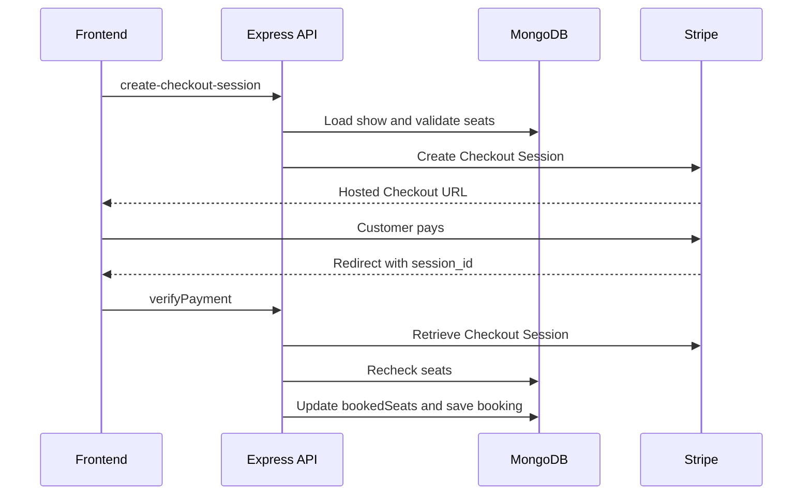

# BookMyShow Backend

Node.js/Express backend API for the BookMyShow full-stack movie-ticket booking project.

[Backend Deployment](https://bookmyshow-backend-lrkh.onrender.com) · [Live Frontend](https://bookmyshow-frontend-ten.vercel.app) · [Full-Stack Repo](https://github.com/kvp9743/bookmyshowClone) · [Frontend Repo](https://github.com/kvp9743/bookmyshow-frontend)

## Overview

The backend provides authentication, movie administration, theater/show management, Stripe Checkout Session creation, payment verification, seat-state updates, and booking persistence.

## Tech Stack

- Node.js / Express.js
- MongoDB / Mongoose
- JSON Web Token
- bcrypt
- cookie-parser
- CORS
- Stripe Node SDK
- dotenv

## Architecture

```text
Routes
  ↓
Authentication / Admin Middleware
  ↓
Controllers
  ↓
Mongoose Models
  ↓
MongoDB Atlas

Booking Controller → Stripe Checkout API
```

## Project Structure

```text
Controller/
DBconnect/
Middleware/
Model/
Routes/
package.json
server.js
```

## API Routes

Protected routes require the bmstoken authentication cookie.

### User
| Method | Endpoint | Purpose |
| --- | --- | --- |
| POST | /api/user/register | Register user |
| POST | /api/user/login | Authenticate and set JWT cookie |
| GET | /api/user/getUserDetails | Get authenticated user |
| POST | /api/user/logOut | Clear authentication cookie |

### Movies
| Method | Endpoint | Access | Purpose |
| --- | --- | --- | --- |
| GET | /api/user/movies/getAllMovies | Authenticated | List movies |
| GET | /api/user/movies/getMovieById | Authenticated | Get movie details |
| POST | /api/user/movies/addMovie | Admin | Add movie |
| PATCH | /api/user/movies/updateMovie | Admin | Update movie |
| DELETE | /api/user/movies/deleteMovie | Admin | Delete movie |

### Theaters / Shows
| Method | Endpoint | Purpose |
| --- | --- | --- |
| GET | /api/user/theaters/getAllTheaters | Get theaters |
| GET | /api/user/theaters/getTheaterByOwner | Get current user's theaters |
| POST | /api/user/theaters/addTheater | Add theater |
| PATCH | /api/user/theaters/updateTheater | Update theater / admin approval status |
| DELETE | /api/user/theaters/deleteTheater | Delete theater |
| POST | /api/user/theaters/addShow | Add show |
| DELETE | /api/user/theaters/deleteShow | Delete show |
| GET | /api/user/theaters/getShowByMovieId | Shows for movie/date grouped by theater |
| GET | /api/user/theaters/getShowByTheaterId | Shows for theater |
| GET | /api/user/theaters/getShowById | Complete show details |

### Booking
| Method | Endpoint | Purpose |
| --- | --- | --- |
| POST | /api/user/booking/create-checkout-session | Validate seats and create Stripe Checkout Session |
| POST | /api/user/booking/verifyPayment | Verify Stripe payment and create booking |
| GET | /api/user/booking/getBookingByUserId | Get current user's bookings |
| DELETE | /api/user/booking/deleteBooking | Delete booking record |

## Authentication

- Registration hashes passwords with bcrypt and a generated salt.
- Login signs a JWT containing the MongoDB user ID.
- JWT expiry is one day.
- Token is stored in the bmstoken HTTP-only cookie.
- Production cookie settings use secure=true and sameSite=none.
- validateUserToken verifies the cookie and attaches req.userId.
- adminVerification rejects non-admin users on protected admin movie mutations.

## Stripe Booking Flow



The backend calculates payment amount from the stored show ticket price instead of trusting a frontend total. Stripe metadata includes userId, showId, and selectedSeats. During verification the backend confirms the session belongs to the authenticated user and checks for an existing booking with the same unique sessionId.

## Models

- User: name, email, password, isAdmin
- Movie: title, description, duration, language, genre, releaseDate, poster
- Theater: name, address, phone, email, owner, isActive
- Show: name, date, time, movie, theater, ticketPrice, totalSeats, bookedSeats
- Booking: show, user, seats, sessionId, paymentStatus

## Environment Variables

```env
PORT=8080
NODE_ENV=development
FRONTEND_URL=http://localhost:5173
dbURL=your_mongodb_connection_string
secretKey=your_jwt_secret
stripeSecretKey=your_stripe_secret_key
```

Never commit .env files or secret values.

## Local Setup

```bash
git clone https://github.com/kvp9743/bookmyshow-backend.git
cd bookmyshow-backend
npm install
npm run dev
```

## CORS and Deployment

Backend: **https://bookmyshow-backend-lrkh.onrender.com**

The server allows the configured FRONTEND_URL origin and credentialed requests. Production uses the Vercel frontend URL and NODE_ENV=production.

## Current Limitations / Future Improvements

Not currently implemented:
- Temporary seat holds before payment.
- Stripe webhooks.
- Atomic booking / transaction-based concurrency handling.
- Stronger server-side ownership checks for theater/show mutation endpoints.
- Rate limiting.
- Helmet.
- MongoDB query sanitization.
- Automated tests.
- Centralized validation/logging.
- Email or SMS ticket notifications.

## Related Repositories

- Full project: https://github.com/kvp9743/bookmyshowClone
- Frontend: https://github.com/kvp9743/bookmyshow-frontend

## Author

**Kiran Pawar** — https://github.com/kvp9743

---

> This repository is part of an independent educational project and is not affiliated with or endorsed by BookMyShow.